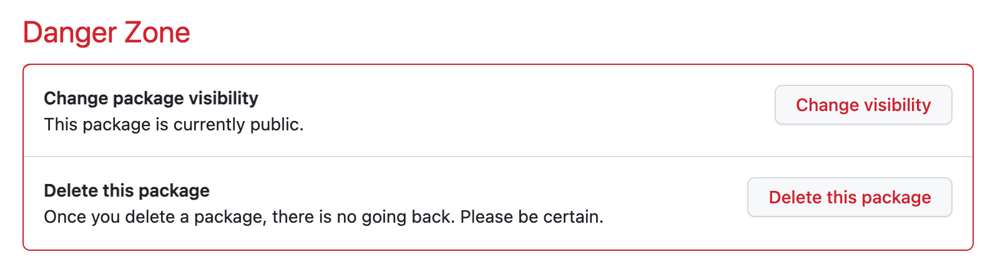
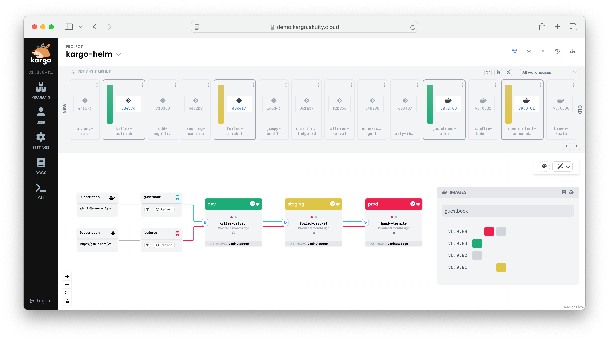

# Kargo Helm Example

This is a GitOps repository of a Kargo Helm example for getting started.

### Features:

* A Warehouse which monitors a container repository for new images
* Three Stage (dev, staging, prod) deploy pipeline
* Image tag promotion
* Direct Git commits to dev, staging
* Feature flag promotion

## Requirements

* Kargo v1.3 (for older Kargo versions, switch to the release-X.Y branch)
* GitHub and a container registry (GHCR.io)
* `git` and `docker` installed

## Instructions

1. Fork this repo, then clone it locally (from your fork).
2. Run the `personalize.sh` to customize the manifests to use your GitHub
   username:

   ```shell
   ./personalize.sh <yourgithubusername>
   ```
3. `git commit` the personalized changes:

   ```shell
   git commit -a -m "personalize manifests"
   git push
   ```
4. Create a guestbook container image repository in your GitHub account. 

   The easiest way to create a new ghcr.io image repository, is by retagging and 
   pushing an existing image with your GitHub username:

   ```shell
   ## docker login ghcr.io

   echo YOUR_GITHUB_TOKEN | docker login ghcr.io -u YOUR_GITHUB_USERNAME --password-stdin 

   docker buildx imagetools create ghcr.io/akuity/guestbook:latest -t ghcr.io/bartpaczkows/guestbook:v0.0.1
   ```

   You will now have a `guestbook` container image repository. e.g.:
   ## https://github.com/bartpaczkows/guestbook/pkgs/container/guestbook
   https://github.com/users/bartpaczkows/packages/container/package/guestbook

5. Change guestbook container image repository to public.

   In the GitHub UI, navigate to the "guestbook" container repository, Package
   settings, and change the visibility of the package to public. This will allow
   Kargo to monitor this repository for new images, without requiring you to 
   configuring Kargo with container image repository credentials.

   

6. Download and install the latest CLI from [Kargo Releases](https://github.com/akuity/kargo/releases/latest)

   ```shell
   ./download-cli.sh /usr/local/bin/kargo
   ```

7. Login to Kargo:

   ```shell
   #kargo login --admin https://<kargo-url>
   kargo login --admin --insecure-skip-tls-verify https://localhost:31444 
   ```

8. Apply the Kargo manifests:

   ```shell
   kargo apply -f ./kargo
   ```

9. Add the Git repository credentials to Kargo (enter the token) This can also be done in the UI
   in the `kargo-helm` Project.

   ```shell
   kargo create credentials github-creds \
     --project kargo-helm \
     --git \
     --username bartpaczkows \
     --repo-url https://github.com/bartpaczkows/kargo-helm-flow.git
   ```

   As part of the promotion process, Kargo requires privileges to commit changes
   to your Git repository, as well as the ability to create pull requests. Ensure
   that the given token has these privileges.

10. Promote the image!

    You now have a Kargo Pipeline which promotes images from the guestbook
    container image repository, through a three-stage deploy pipeline. Visit
    the `kargo-helm` Project in the Kargo UI to see the deploy pipeline.

    

    To promote, click the target icon to the left of the `dev` Stage, select
    the detected Freight, and click `Yes` to promote. Once promoted, the Freight
    will be qualified to be promoted to downstream Stages (`staging`, `prod`).


## Simulating a release

To simulate a release, simply retag an image with a newer semantic version. e.g.:

```shell
docker buildx imagetools create ghcr.io/akuity/guestbook:latest -t ghcr.io/bartpaczkows/guestbook:v0.0.2
```

Then refresh the Warehouse in the UI to detect the new Freight.


## Promoting a feature

Edit the `base/feature-flags.yaml` with a new setting. This will be detected
by the `features` Warehouse as a promotable configuration.


### full-color list for kargo.akuity.io/color annotaitons
  red,
  orange,
  amber,
  yellow,
  lime,
  green,
  teal,
  cyan,
  sky,
  blue,
  violet,
  purple,
  fuchsia,
  pink,
  rose,
  gray


## how to list role of Kargo
kargo get roles --project kargo-helm

## how to get details of a specific role
kargo get role kargo-admin --project kargo-helm --output yaml

##  how to see details of SA, RoleBinding and Role of the Role you created
kargo get role kargo-developer \
  --as-kubernetes-resources -o yaml \
  --project kargo-helm


### HOw to installa ArgoEvents on the cluster
kubectl create namespace argo-events
kubectl apply -f https://raw.githubusercontent.com/argoproj/argo-events/stable/manifests/install.yaml
kubectl apply -f https://raw.githubusercontent.com/argoproj/argo-events/stable/manifests/install-validating-webhook.yaml
kubectl apply -n argo-events -f https://raw.githubusercontent.com/argoproj/argo-events/stable/examples/eventbus/native.yaml


## edit  argo-events-role allow creating workflows in the "argoproj.io" API group (this will resovle the problem of creating workflows in "argo" namespace as ArgoWorkflows will be running in "argo" namespace)
kubectl get ClusterRole argo-events-role -o yaml
```
- apiGroups:
  - argoproj.io
  resources:
  - workflows
  verbs:
  - create
```

## apply webhook EventSource
kubectl apply -n argo-events -f argo-events/webhook.yaml
kubectl -n=argo-events get eventsource
kubectl -n=argo-events get service

# check the pod name of the webhook you create
kubectl -n=argo-events get pods

# forward the port on the pod 
kubectl -n=argo-events port-forward webhook-eventsource-mqwhl-576c7bb98c-jbj5d 12000:12000

# check if webhook works
curl -X POST http://localhost:12000/example -H "Content-Type: application/json" -d '{"message": "My first webhook"}'

# create sensors
kubectl  -n=argo-events apply argo-events/sensor.yaml
kubectl -n=argo-events apply -f argo-events/sensor-2.yaml


## ArgoWorkflow Installation
# Install ArgoWorkflow
kubectl create namespace argo
kubectl apply -n argo -f "https://github.com/argoproj/argo-workflows/releases/download/v3.6.7/quick-start-minimal.yaml

# Forward the Server's port to access the UI:
kubectl -n argo-events port-forward service/argo-server 2746:2746

# Navigate your browser to https://localhost:2746.
https://localhost:2746

# submit hello-world argo-workflow
argo submit -n argo --watch ./argo-workflows/hello-world.yaml


